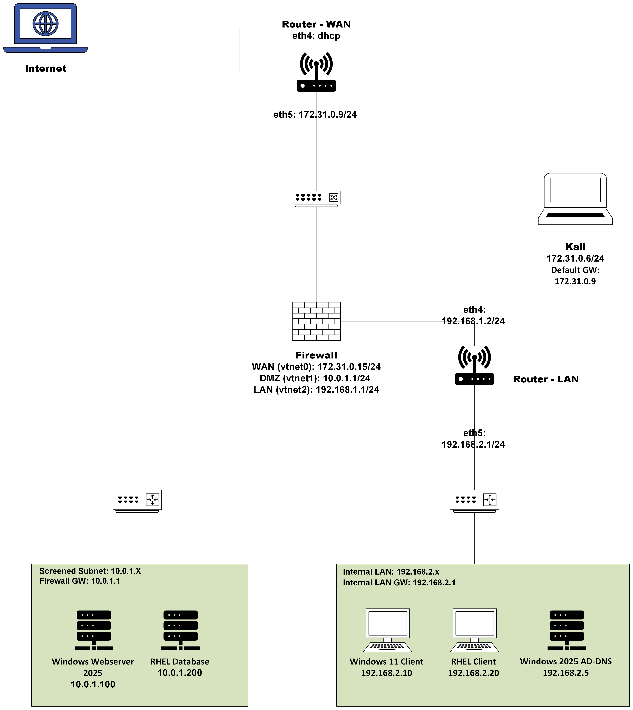
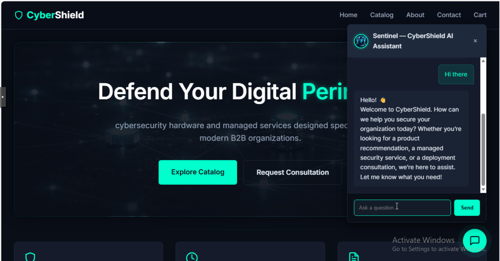
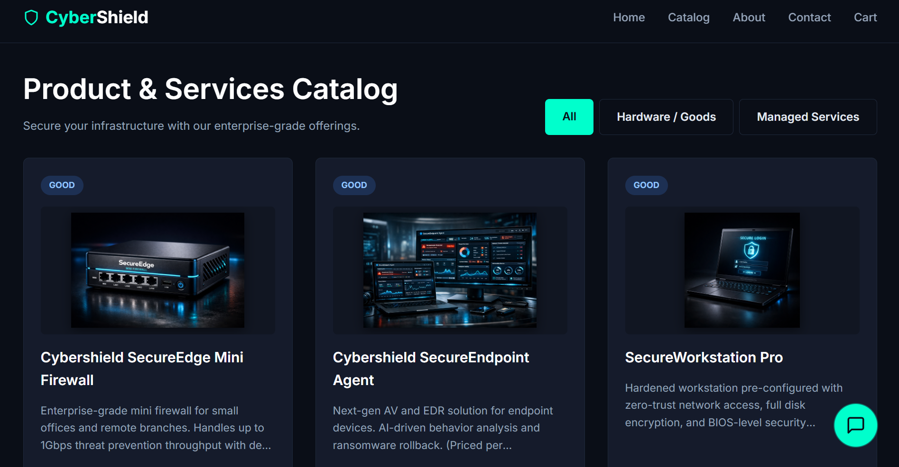
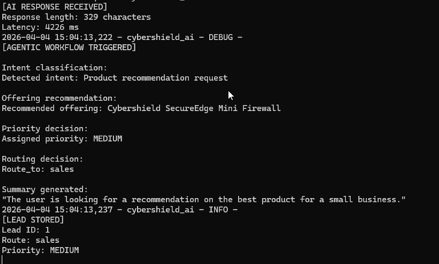
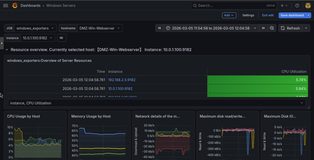
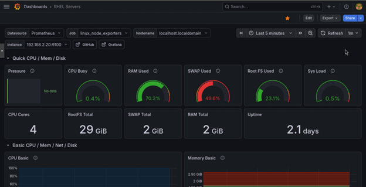
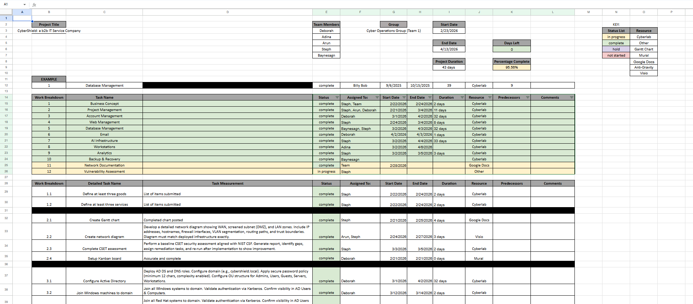

# CyberShield Enterprise Infrastructure & Security Platform 

**Enterprise network security · DMZ architecture · Web application deployment · AI chatbot integration · Monitoring · Project management**

## Overview

CyberShield is a simulated B2B cybersecurity services company built as part of an enterprise infrastructure deployment project for NCyTE's Virtual Cybersecurity Career Challenge (VCCC), on which I worked with a team for about five months. The environment was designed to support realistic business operations, including secure network segmentation, centralized identity services, public-facing web services, database-backed e-commerce functionality, AI-assisted lead generation, internal email, monitoring, and disaster recovery planning.

The project used a segmented enterprise architecture with separate WAN, DMZ, transit, and internal LAN zones. Traffic between zones was controlled through an OPNsense firewall and VyOS routing infrastructure. Public-facing services were hosted in the DMZ, while identity services, workstations, monitoring, and administrative resources were placed in the trusted internal LAN.

This repository contains a portfolio version of the project documentation, architecture notes, screenshots, diagrams, and implementation summaries.

## My Role

I contributed heavily to the design, implementation, documentation, project management, web application development, AI chatbot workflow, monitoring, and security validation portions of the CyberShield environment.

My primary responsibilities included:

- Defined the CyberShield business concept, including cybersecurity products and managed service offerings
- Created and maintained project planning materials, including the Gantt chart and documentation structure
- Helped design the enterprise network diagram and segmented architecture
- Completed a baseline NIST Cybersecurity Framework (CSF) security assessment using the Cybersecurity and Infrastructure Security Agency's (CISA) Cyber Security Evaluation Tool (CSET)
- Built and deployed the CyberShield web application
- Implemented e-commerce functionality, including product/service listings, shopping cart behavior, and checkout flow
- Designed the relational database schema for products, orders, order items, and AI-generated leads
- Integrated an AI chatbot into the web application using a GPU-backed OpenWebUI-compatible API
- Designed an agentic workflow to classify user intent, generate recommendations, assign priority, route leads, and store structured results
- Implemented infrastructure monitoring and analytics using Prometheus and Grafana
- Created dashboard views for system performance and service visibility
- Helped document firewall rules, IP addressing, routing, NAT, service ports, and infrastructure dependencies
- Contributed to vulnerability assessment and remediation planning

## Project Scope

The CyberShield environment included the following major components:

| Area | Description |
|---|---|
| Network Architecture | Segmented WAN, DMZ, transit, and LAN zones |
| Firewall & Routing | OPNsense firewall with VyOS WAN/LAN routing |
| Identity Services | Windows Server Active Directory and DNS |
| Web Application | Flask application hosted behind IIS reverse proxy |
| Database | MariaDB backend hosted on a RHEL server |
| AI Integration | Chatbot integrated through OpenWebUI-compatible API |
| Monitoring | Prometheus metrics collection and Grafana dashboards |
| Email | Internal hMailServer deployment for lab communication |
| Workstations | Windows 11 and RHEL clients joined to enterprise services |
| Backup & Recovery | MariaDB backup and restore testing |
| Project Management | Gantt chart, Kanban board, task tracking, documentation, team communications, and service mapping |

## Architecture Summary

The environment used a defense-in-depth design with multiple trust zones:

| Zone | Network | Purpose |
|---|---|---|
| WAN | 172.31.0.0/24 | Simulated external network and upstream access |
| DMZ | 10.0.1.0/24 | Public-facing web and database services |
| Transit | 192.168.1.0/24 | Firewall-to-LAN routing segment |
| Internal LAN | 192.168.2.0/24 | Active Directory, workstations, monitoring, and internal services |

All inter-zone communication was controlled through firewall rules and routing policies. The DMZ isolated public-facing services from internal identity and workstation systems.

## Technologies Used

### Infrastructure & Networking

- Proxmox virtual machines
- OPNsense
- VyOS
- Windows Server 2025
- Red Hat Enterprise Linux
- Windows 11
- Active Directory Domain Services
- DNS
- NAT
- Static routing
- Firewall rule design

### Web & Application Stack

- Python
- Flask
- Waitress WSGI
- Microsoft IIS
- URL Rewrite
- Application Request Routing
- HTML/CSS/JavaScript
- MariaDB
- Flask-SQLAlchemy

### AI & Automation

- OpenWebUI-compatible API
- GPU-backed LLM model
- Backend API proxying
- Environment variable-based API key handling
- Intent classification
- AI-generated recommendations
- Lead priority assignment
- Automated lead routing
- Structured database logging

### Monitoring & Analytics

- Prometheus
- Grafana
- Windows Exporter
- Linux Node Exporter
- System metrics
- Service uptime monitoring
- Dashboard visualization

### Security & Validation

- CSET NIST CSF assessment
- Network segmentation
- DMZ isolation
- Least-privilege traffic flow
- Firewall access control
- Web server hardening
- Security headers
- Database access restrictions
- Backup and recovery testing
- Vulnerability assessment planning

## Key Accomplishments

- Built a simulated enterprise infrastructure environment for a cybersecurity services company
- Designed a segmented network using WAN, DMZ, transit, and internal LAN zones
- Helped document firewall rules, static routes, NAT behavior, and traffic flow
- Deployed a DMZ-hosted Flask web application behind an IIS reverse proxy
- Added HTTPS support, HTTP-to-HTTPS redirect behavior, and basic web hardening controls
- Implemented an e-commerce-style product and service catalog
- Designed database tables for products, orders, order items, and AI leads
- Integrated an AI chatbot into the web application backend
- Built an agentic AI workflow for lead classification, recommendations, priority assignment, and routing
- Stored AI-generated lead data in MariaDB
- Implemented monitoring using Prometheus and Grafana
- Created infrastructure dashboards for Windows and Linux systems
- Contributed to project documentation, Gantt planning, and service mapping
- Completed a CSET/NIST-style baseline assessment and contributed to vulnerability assessment planning

## Visual Walkthrough

### Enterprise Network Architecture

The CyberShield environment used a segmented enterprise architecture with separate WAN, DMZ, transit, and internal LAN zones. The network diagram shows the relationship between the firewall, routing infrastructure, DMZ services, internal LAN systems, Active Directory/DNS, web server, database server, and client workstations.



### Web Application with AI Chatbot

The CyberShield web platform provided a public-facing interface for the simulated cybersecurity company. The homepage included an integrated AI chatbot designed to support customer interaction, product/service guidance, and lead generation.



### Product and Service Catalog

The web application included cybersecurity product and service listings for CyberShield’s simulated business offerings. This helped demonstrate database-backed product retrieval, web application functionality, and e-commerce-style user flow.



### AI Agentic Workflow

The AI chatbot workflow classified user intent, generated product or service recommendations, assigned a lead priority level, routed the lead to the appropriate business function, and stored structured results in the backend database.



### Monitoring and Analytics

Prometheus and Grafana were used to collect and visualize infrastructure metrics from Windows and Linux systems. The dashboards provided visibility into system health, resource usage, uptime, and operational status.





### Project Planning

The project used a Gantt chart to organize workstreams, deadlines, implementation phases, documentation tasks, and final deliverables.



## Web Application

The CyberShield web application was hosted on a Windows Server system in the DMZ. IIS handled inbound HTTP/HTTPS traffic and reverse-proxied requests to a Flask application running through Waitress on localhost.

The application supported:

- cybersecurity product listings
- managed service listings
- shopping cart behavior
- checkout flow
- customer order creation
- AI chatbot interaction
- AI-generated lead storage
- contact forms

The backend application connected to a MariaDB database hosted on a RHEL server in the DMZ. Users interacted with the database only through the web application, while direct LAN-to-database access was blocked by firewall policy.

## AI Chatbot & Agentic Workflow

The CyberShield platform included an AI-powered chatbot integrated into the Flask backend. The chatbot communicated with an OpenWebUI-compatible API using a GPU-backed language model.

The workflow performed several automated tasks:

1. Accepted user prompts through the web interface
2. Classified user intent
3. Generated cybersecurity product or service recommendations
4. Assigned a lead priority level
5. Routed the lead to the appropriate business function
6. Generated a structured summary
7. Stored the result in the MariaDB `ai_leads` table
8. Logged workflow execution details and latency metrics

API authentication was handled through environment variables, keeping the API key out of client-side code.

## Database Design

The CyberShield database used MariaDB with SQLAlchemy models defined in the Flask application.

Core tables included:

| Table | Purpose |
|---|---|
| `products` | Stores cybersecurity products and services |
| `orders` | Stores customer and order information |
| `order_items` | Stores line items associated with orders |
| `ai_leads` | Stores structured chatbot-generated lead data |

The database supported product retrieval, order processing, AI lead generation, query testing, backup, and recovery validation.

## Monitoring & Analytics

The monitoring stack used Prometheus for metrics collection and Grafana for visualization.

Monitoring covered:

- Windows server metrics
- Linux server metrics
- CPU usage
- memory usage
- disk usage
- network statistics
- system uptime
- service visibility

Prometheus collected metrics from Windows Exporter and Linux Node Exporter endpoints. Grafana dashboards provided administrative visibility into infrastructure health.

## Security Concepts Demonstrated

- Network segmentation
- DMZ architecture
- Defense in depth
- Firewall-controlled traffic flow
- Least privilege
- Web application hardening
- Backend API security
- Environment variable secret handling
- Database access restriction
- Centralized identity management
- Infrastructure monitoring
- Backup and recovery planning
- Technical documentation
- Vulnerability assessment planning
- Project management

## Network Configuration Record

The Network Configuration Record documents the technical design and implementation details of the CyberShield environment, including network zones, IP addressing, firewall rules, routing, Active Directory/DNS, web server configuration, AI integration, database setup, monitoring, email services, workstation validation, backup/recovery, and service dependencies.

[View the Network Configuration Record](docs/network-configuration-record.md)

## Project Management

In addition to technical implementation, this project required structured project coordination. I created and maintained project planning materials, including the Gantt chart and task breakdown. The work breakdown structure tracked business concept development, web management, database management, AI infrastructure, analytics, documentation, and vulnerability assessment tasks.

This helped organize team responsibilities, deadlines, resource usage, and project completion status.

## Lessons Learned

This project strengthened my understanding of how enterprise infrastructure components depend on one another across networking, identity, application, database, monitoring, and security layers.

Key lessons included:

- Segmented networks require careful planning of routing, NAT, DNS, and firewall policies
- DMZ services should be isolated from internal systems whenever possible
- Web applications need secure deployment architecture, not just functional code
- AI features should be proxied through the backend and should not expose API keys to clients
- Monitoring is essential for operational visibility and troubleshooting
- Clear documentation makes complex environments easier to maintain, validate, and explain
- Project management matters because infrastructure deployments involve many interdependent tasks

## Repository Contents

```text
docs/
  case-study.md
  network-configuration-record.md
  project-management-summary.md

screenshots/
  database/
    agentic-workflow.png
    gantt-chart.png

  infrastructure/
    network-diagram.png

  monitoring/
    grafana-dashboard-rhel.png
    grafana-dashboard.png

  web-app/
    website-homepage-with-chatbot.png
    website-products.png
```
